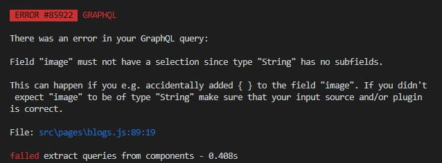
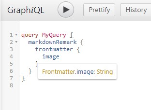

<!-- 

https://www.instagram.com/p/CCUGjqZBmwB/

 -->

Trying to query (via GraphQL) an image that's placed in the frontmatter of markdown file, I recieved this error:
Error: “Field “image” must not have a selection since type “String” has no subfields.

Here's everything I've done:

- Modified image path multiple times
- wrapped image in double quotes
    - from image: learningsql.png to image: "learningsql.png"
- Delete `.cache` and `public` folder
    - This can be done using `npm run clean` (Start using the npm scripts guys! Read `package.json` for more scripts)
- Changed order of plugins in gatsby-config, specifically `gatsby-file-system`, `gatsby-plugin-sharp`, `gatsby-transformer-sharp`
- Made sure I had the plugins installed
    - Run `npm ls` to see the list of packages you have. 
    - If a long list is returned, `npm ls -depth 0` so you can just see the first level of packages and not including their dependencies.

Let's take a deeper look into the error and try to understand as much as we can.
Field "image" must not have a selection since type "String" has no subfields.
Type String has no subfields right? That makes sense. But we don't want `image` to be recongized as an String. Instead, we want it to be recognized as a File.

By visiting `localhost:<PORT>/__graphql`, you'll be able to use (a graphical interactive in-browser GraphQL IDE)[https://github.com/graphql/graphiql/tree/main/packages/graphiql#readme]. Hovering the cursor on one of the subfields will reveal it's type. See image below.

While I debugged, I referenced back to the GraphQL IDE to see if 
1. The type has changed
2. I am able to access subfields, specifically `childImageSharp`.

Note to self,
- ref S.O.
- set image field type as File