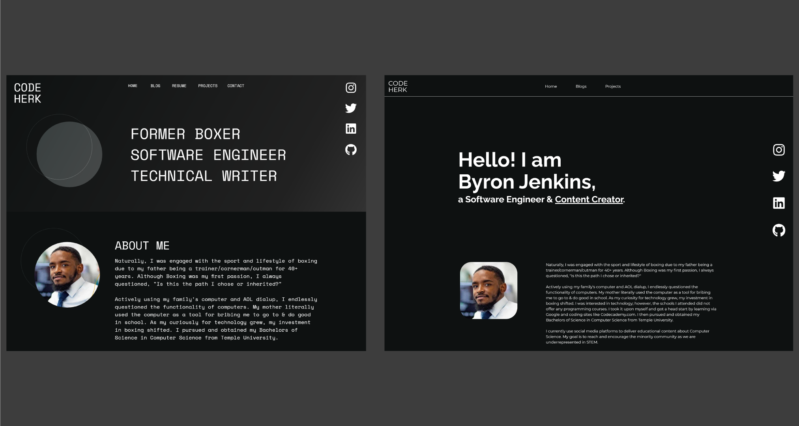
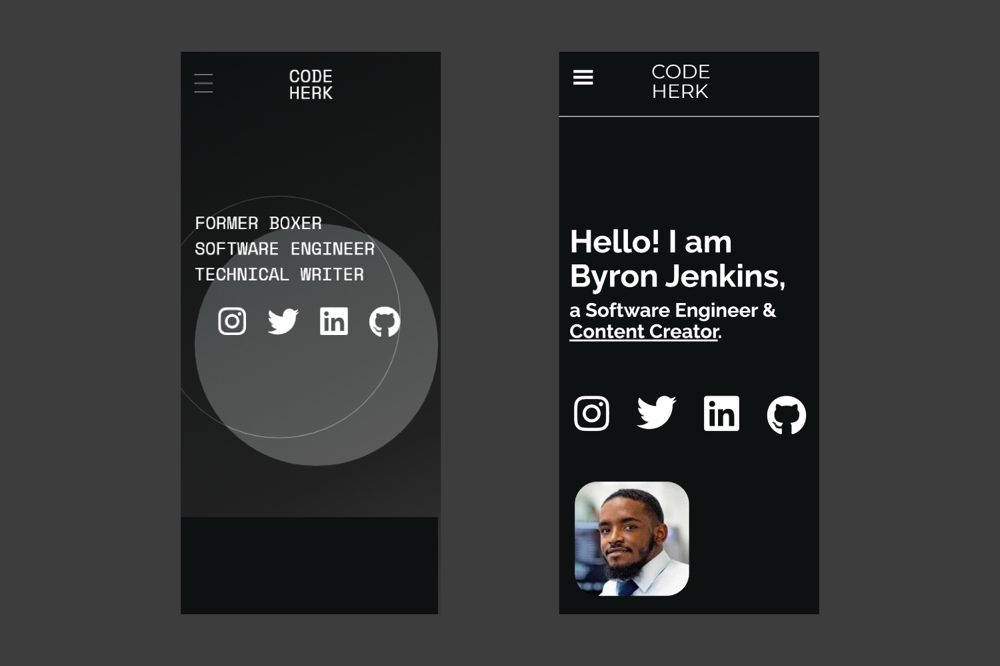

That’s right! All code. I redesigned my personal site to include my resume, blogs, and projects.

Designs made in Adobe XD.

**From Left to Right**: Desktop Design, Code Result



As I worked on the coding from the designs, the typography continued to feel like it didn't fit. I made some big changes that makes it different from design and I was completely okay with that.


  
**From Left to Right**: Mobile Design, Code Result

It is **crucial** to make sure your site is responsive, meaning that it renders well on a variety of devices and window or screen sizes. I achieved that by: 

- Using media queries in CSS. Here's how it looks:

``` scss
@media (min-width: 800px) {
  .example-class {
    padding: 0 6rem;
  }
}
``` 
This means that when the viewport has a width of 800px or more, ```.example-class``` will have that assigned padding.

- coding for mobile first (look into Mobile First Design). See the example scss below from my website (look up Sassy CSS and how it differs from CSS). 
``` scss
.article {
      margin: 0 auto;
      padding: 0 2rem;
      transition: all 1s;
      
      @media (min-width: 800px) {
          padding: 0 6rem;
      }
    
      @media (min-width: 1224px) {
          padding: 0 25vw;
      }
}
```
So ```.article``` has the mobile styling done first, and it doesn't need the explicit media query because I have done the query with the other sizes. I have 3 designs for different viewport sizes:
  - min-width > 800px (mobile)
  - min-width <= 800px & min-width > 1224px (tablet)
  - min-width <= 1224px (desktop)


# TECH & TOOLS
- HTML, CSS, JS 
  (aka the fundamental tech needed for web development)
- [React](https://reactjs.org/) 
   (JavaScript library for building user interfaces)
- [GatsbyJS](https://www.gatsbyjs.com/)
   (modern web framework for blazing fast websites)
- [Adobe XD](https://www.adobe.com/products/xd.html)
   (UI/UX prototyping tool)
- [GitHub](https://github.com/)
   (code hosting platform for version control)
- [GitHub Pages](https://pages.github.com/)
   (static site hosting service from GitHub repository)

If you would like to see the code of this website, [visit my repo on GitHub. The source code is under the dev branch](https://github.com/codeherk/codeherk.github.io/tree/dev).

Let me know what you think!
